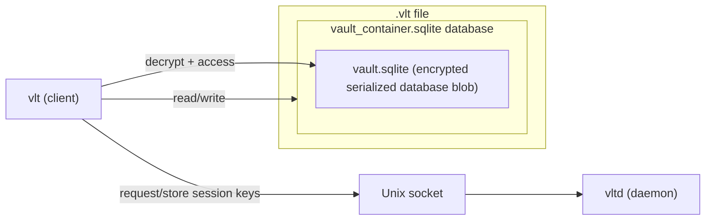
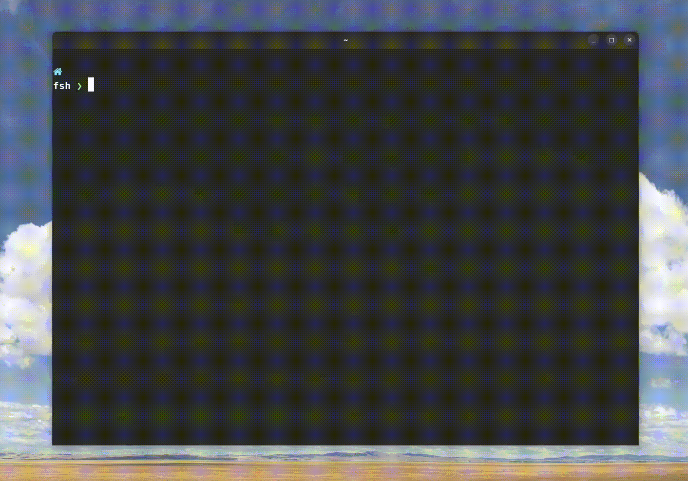

<!--
    This file is generated by gen-readme.sh.
    Do not edit this file directly.
    Instead, edit 'readme.templ.md' and run the script.
-->
<!-- omit in toc -->
<p align="center">
  
</p>

# vlt - A secure command-line tool for managing secrets in your terminal.

[](https://goreportcard.com/report/github.com/ladzaretti/vlt-cli)

`vlt` provides secure, local management of your sensitive information, ensuring your secrets remain encrypted at rest and are only briefly decrypted in memory when accessed.

<!-- omit in toc -->
## Table of Content

- [vlt - A secure command-line tool for managing secrets in your terminal.](#vlt---a-secure-command-line-tool-for-managing-secrets-in-your-terminal)
  - [Supported Platforms](#supported-platforms)
  - [Installation](#installation)
    - [Option 1: Download a release](#option-1-download-a-release)
      - [Optional install script](#optional-install-script)
    - [Option 2: Build from source (requires Go 1.24)](#option-2-build-from-source-requires-go-124)
  - [Design Overview](#design-overview)
    - [vlt - cli client](#vlt---cli-client)
    - [vltd - session manager daemon](#vltd---session-manager-daemon)
  - [Crypto/Security](#cryptosecurity)
  - [Usage](#usage)
  - [Configuration file](#configuration-file)
  - [Examples](#examples)
    - [Tips and Tricks](#tips-and-tricks)
      - [Interactive Secret Selection](#interactive-secret-selection)
      - [Sync to a Git Repository](#sync-to-a-git-repository)
    - [Demo](#demo)

## Supported Platforms

- **OS**: Linux
  - Tested on (`amd64`):
    - Debian 12
    - Fedora 42
- **Arch**: Prebuilt binaries are available for `amd64`, `arm64`, and `386`.

## Installation

### Option 1: Download a release

Visit the [Releases](https://github.com/ladzaretti/vlt-cli/releases) page for a list of available downloads.

#### Optional install script
After downloading and extracting an archive, the `install.sh` script can be used to:

- Copy the `vlt` and `vltd` binaries to `/usr/local/bin`
- Install and enable the `vltd` systemd user service for managing vault sessions

### Option 2: Build from source (requires Go 1.24)

```bash
# Clone and build
git clone https://github.com/ladzaretti/vlt-cli.git
cd vlt-cli
make build-dist

# Optional: run the install script
./dist/install.sh
```
This packs the `vlt` and `vltd` binaries in `./dist/`.

>[!WARNING]
> Installation via `go install` is not supported due to a patched vendored dependency.

## Design Overview
### vlt - cli client
The `vlt` cli manages secrets stored in a vault system composed of two layers:
- `vault_container.sqlite` is the outer SQLite database. It stores metadata and a single encrypted, serialized SQLite instance as a binary blob.
- `vault.sqlite` is a serialized and encrypted inner SQLite database that contains the actual user data.
  - The decrypted `vault.sqlite` is held in the `vlt` process memory only and is never written to disk.

### vltd - session manager daemon
The `vltd` daemon manages derived encryption keys and exposes a Unix socket that `vlt` uses to obtain them. Only `vlt` accesses the database files directly.



## Crypto/Security
- **Key Derivation & Auth**: Uses `argon2id` to derive keys from the master password and verify authentication.

- **Encryption**:  
  - Secrets are encrypted with `AES-256-GCM`, using unique nonces for each encrypted value.  
  - The backing `SQLite` database is encrypted at rest and only decrypted into memory after authentication.

- **Memory-Safety**: Secrets are stored in memory only.

## Usage
```console
$ vlt --help
Name:
  vlt - A secure command-line tool for managing secrets in your terminal.

Description:
  User secrets are stored in a fully encrypted, serialized SQLite vault on disk.

  The encrypted vault is only decrypted into memory during a session, and individual secrets
  are decrypted on demand. Decrypted values are ephemeral and cleared from memory immediately after use.

  The vault file is never written to disk in plaintext. 

Environment Variables:
  VLT_CONFIG_PATH - overrides the default config path: "~/.vlt.toml".

Usage:
  vlt [command]

Available Commands:
  config      Resolve and inspect the active vlt configuration (subcommands available)
  create      Initialize a new vault
  export      Export secrets to a file or stdout
  find        Search for secrets
  generate    Generate a random password
  help        Help about any command
  import      Import secrets from file (supports Firefox, Chromium, and custom formats)
  login       Authenticate the user
  logout      Log out of the current session
  remove      Remove secrets
  rotate      Rotate the master password
  save        Save a new secret
  show        Retrieve a secret value
  update      Update secret data or metadata (subcommands available)
  vacuum      Reclaim unused space in the database
  version     Show version

Flags:
  -h, --help   help for vlt

Use "vlt [command] --help" for more information about a command.
```

## Configuration file

The optional configuration file can be generated using `vlt config generate` command:

```toml
[vault]
# Vlt database path (default: '~/.vlt' if not set)
# path = ''
# How long a session lasts before requiring login again (default: '1m')
# session_duration = ''
# Maximum number of historical vault snapshots to keep (default: 3, 0 disables history)
# max_history_snapshots = 3

# Clipboard configuration: Both copy and paste commands must be either both set or both unset.
[clipboard]
# The command used for copying to the clipboard (default: ['xsel', '-ib'] if not set)
# copy_cmd = []
# The command used for pasting from the clipboard (default: ['xsel', '-ob'] if not set)
# paste_cmd = []

# Optional lifecycle hooks for vault events
[hooks]
# Command to run after a successful login
# post_login_cmd = []
# Command to run after any vault write (e.g., create, update, delete)
# post_write_cmd = []
```

## Examples

These are minimal examples to get you started.  
For detailed usage and more examples, run each subcommand with `--help`.

```shell
# Create a new vault
vlt create

# Import secrets from a file (auto-detects format if compatible, e.g., Firefox or Chromium)
vlt import passwords.csv

# Save a secret interactively
vlt save

# Remove a secret by its name or label
vlt remove foo

# Find secrets with names or labels containing "foo"
vlt find "*foo*"

# List all secrets in the vault
vlt find

# Show a secret by name or label and copy its value to the clipboard
vlt show foo --copy-clipboard

# Show a secret by ID and write its value to a file
vlt show --id 42 --output secret.file

# Use a glob pattern and label filter, print to stdout (unsafe)
vlt show "*foo*" --label "*bar*" --stdout

# Rename a secret by ID
vlt update --id 42 --set-name foo

# Update secret value with a random generated secret
vlt update secret foo --generate

# Rotate the master password
vlt rotate
```


### Tips and Tricks

#### Interactive Secret Selection

```shell
# Use fzf to select a secret interactively and copy its value to the clipboard
vlt login
vlt ls -P | fzf --header-lines=1 | awk '{print $1}' | xargs -r vlt show -c --id
```

#### Sync to a Git Repository
Use the `post-login` and `post-write` hooks to sync the vault with a bare Git repository.

Example setup using fish shell:
```shell
# Bare git repository alias
$ cat .config/fish/alias.fish | grep vault
alias vault_git='/usr/bin/git --git-dir="$HOME/.vltd/" --work-tree="$HOME"'

# Vault hooks configuration
$ cat ~/.vlt.toml | grep -A3 hooks
[hooks]
post_login_cmd=['fish','-c','vault_git pull']
post_write_cmd=['fish','-c',"vault_git add -u && vault_git commit -m \"$(date +'%Y-%m-%d %H:%M:%S')\" && vault_git push"]
```

### Demo
<details>
  <summary>Play</summary>

  

</details>