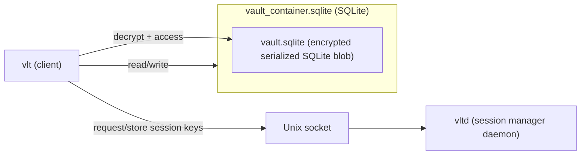

<!--
    This file is generated by gen-readme.sh.
    Do not edit this file directly.
    Instead, edit 'readme.templ.md' and run the script.
-->
# vlt — an encrypted in-memory secret manager for the terminal
[](https://goreportcard.com/report/github.com/ladzaretti/vlt-cli)

`vlt` is a fast and secure command-line tool for storing and managing secrets in an encrypted, in-memory vault.

## Supported Platforms

- **OS**: Linux
  - Tested on (`amd64`):
    - Debian 12
    - Fedora 42
- **Arch**: Prebuilt binaries are available for `amd64`, `arm64`, and `386`.

## Installation

### Option 1: Download a release

Visit the [Releases](https://github.com/ladzaretti/vlt-cli/releases) page for a list of available downloads.

#### Optional install script
After downloading and extracting an archive, the `install.sh` script can be used to:

- Copy the `vlt` and `vltd` binaries to `/usr/local/bin`
- Install and enable the `vltd` systemd user service for managing vault sessions

### Option 2: Build from source

```bash
git clone https://github.com/ladzaretti/vlt-cli.git
cd vlt-cli
make build-dist

# Optional, install via script.
./dist/install.sh
```
This packs the `vlt` and `vltd` binaries in `./dist/`.

>[!NOTE]
> Installation via `go install` is not supported due to a patched vendored dependency.

## Design Overview
### vlt - cli client
The `vlt` cli manages secrets stored in a vault system composed of two layers:
- `vault_container.sqlite` is the outer SQLite database. It stores metadata and a single encrypted, serialized SQLite instance as a binary blob.
- `vault.sqlite` is a serialized and encrypted inner SQLite database that contains the actual user data.
  - The decrypted `vault.sqlite` is held in the `vlt` process memory only and is never written to disk.

### vltd - daemon
The `vltd` daemon manages derived encryption keys and exposes a Unix socket that `vlt` uses to obtain them. Only `vlt` accesses the database files directly.



## Usage
```console
$ vlt --help
vlt is an encrypted in-memory command-line secret manager.

Environment Variables:
    VLT_CONFIG_PATH: overrides the default config path: "~/.vlt.toml".

Usage:
  vlt [command]

Available Commands:
  completion  Generate the autocompletion script for the specified shell
  config      Resolve and inspect the active vlt configuration (subcommands available)
  create      Initialize a new vault
  export      Export secrets to a file or stdout
  find        Search for secrets
  generate    Generate a random password
  help        Help about any command
  import      Import secrets from file
  login       Authenticate the user
  logout      Log out of the current session
  remove      Remove secrets
  rotate      Rotate the master password
  save        Save a new secret
  show        Retrieve a secret value
  update      Update secret data or metadata (subcommands available)
  version     Show version

Flags:
  -h, --help   help for vlt

Use "vlt [command] --help" for more information about a command.
```

## Configuration file

The optional configuration file can be generated using `vlt config generate` command:

```toml
[vault]
# Vlt database path (default: '~/.vlt' if not set)
# path = ''
# How long a session lasts before requiring login again (default: '1m')
# session_duration = ''

# Clipboard configuration: Both copy and paste commands must be either both set or both unset.
[clipboard]
# The command used for copying to the clipboard (default: ['xsel', '-ib'] if not set)
# copy_cmd = []
# The command used for pasting from the clipboard (default: ['xsel', '-ob'] if not set)
# paste_cmd = []

# Optional lifecycle hooks for vault events
[hooks]
# Command to run after a successful login
# post_login_cmd = []
# Command to run after any vault write (e.g., create, update, delete)
# post_write_cmd = []
```

## Examples
TODO