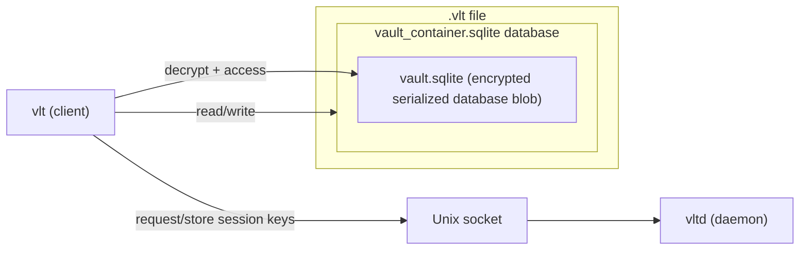

<!-- omit in toc -->
# vlt — an encrypted in-memory secret manager for the terminal

[](https://goreportcard.com/report/github.com/ladzaretti/vlt-cli)

`vlt` is a secure command-line tool for storing and managing secrets in an encrypted, in-memory vault.

<!-- omit in toc -->
## Table of Content

- [Supported Platforms](#supported-platforms)
- [Installation](#installation)
  - [Option 1: Download a release](#option-1-download-a-release)
    - [Optional install script](#optional-install-script)
  - [Option 2: Build from source (requires Go 1.24)](#option-2-build-from-source-requires-go-124)
- [Design Overview](#design-overview)
  - [vlt - cli client](#vlt---cli-client)
  - [vltd - session manager daemon](#vltd---session-manager-daemon)
- [Crypto/Security](#cryptosecurity)
- [Usage](#usage)
- [Configuration file](#configuration-file)
- [Examples](#examples)

## Supported Platforms

- **OS**: Linux
  - Tested on (`amd64`):
    - Debian 12
    - Fedora 42
- **Arch**: Prebuilt binaries are available for `amd64`, `arm64`, and `386`.

## Installation

### Option 1: Download a release

Visit the [Releases](https://github.com/ladzaretti/vlt-cli/releases) page for a list of available downloads.

#### Optional install script
After downloading and extracting an archive, the `install.sh` script can be used to:

- Copy the `vlt` and `vltd` binaries to `/usr/local/bin`
- Install and enable the `vltd` systemd user service for managing vault sessions

### Option 2: Build from source (requires Go 1.24)

```bash
# Clone and build
git clone https://github.com/ladzaretti/vlt-cli.git
cd vlt-cli
make build-dist

# Optional: run the install script
./dist/install.sh
```
This packs the `vlt` and `vltd` binaries in `./dist/`.

>[!WARNING]
> Installation via `go install` is not supported due to a patched vendored dependency.

## Design Overview
### vlt - cli client
The `vlt` cli manages secrets stored in a vault system composed of two layers:
- `vault_container.sqlite` is the outer SQLite database. It stores metadata and a single encrypted, serialized SQLite instance as a binary blob.
- `vault.sqlite` is a serialized and encrypted inner SQLite database that contains the actual user data.
  - The decrypted `vault.sqlite` is held in the `vlt` process memory only and is never written to disk.

### vltd - session manager daemon
The `vltd` daemon manages derived encryption keys and exposes a Unix socket that `vlt` uses to obtain them. Only `vlt` accesses the database files directly.



## Crypto/Security
- **Key Derivation & Auth**: Uses `argon2id` to derive keys from the master password and verify authentication.

- **Encryption**:  
  - Secrets are encrypted with `AES-256-GCM`, using unique nonces for each encrypted value.  
  - The backing `SQLite` database is encrypted at rest and only decrypted into memory after authentication.

- **Memory-Safety**: Secrets are stored in memory only.

## Usage
```console
$ vlt --help
{{USAGE}}
```

## Configuration file

The optional configuration file can be generated using `vlt config generate` command:

```toml
{{CONFIG}}
```

## Examples
TODO