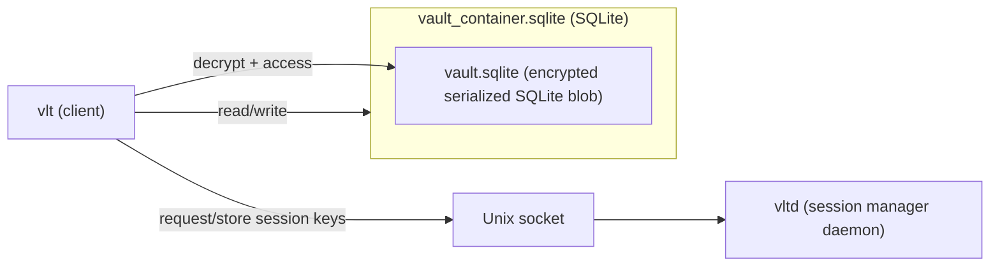

# vlt — an encrypted in-memory secret manager for the terminal
[](https://goreportcard.com/report/github.com/ladzaretti/vlt-cli)

`vlt` is a fast and secure command-line tool for storing and managing secrets in an encrypted, in-memory vault.

## Supported Platforms

- **OS**: Linux
  - Tested on (`amd64`):
    - Debian 12
    - Fedora 42
- **Arch**: Prebuilt binaries are available for `amd64`, `arm64`, and `386`.

## Installation

### Option 1: Download a release

Visit the [Releases](https://github.com/ladzaretti/vlt-cli/releases) page for a list of available downloads.

#### Optional install script
After downloading and extracting an archive, the `install.sh` script can be used to:

- Copy the `vlt` and `vltd` binaries to `/usr/local/bin`
- Install and enable the `vltd` systemd user service for managing vault sessions

### Option 2: Build from source

```bash
git clone https://github.com/ladzaretti/vlt-cli.git
cd vlt-cli
make build-dist

# Optional, install via script.
./dist/install.sh
```
This packs the `vlt` and `vltd` binaries in `./dist/`.

>[!NOTE]
> Installation via `go install` is not supported due to a patched vendored dependency.

## Design Overview
### vlt - cli client
The `vlt` cli manages secrets stored in a vault system composed of two layers:
- `vault_container.sqlite` is the outer SQLite database. It stores metadata and a single encrypted, serialized SQLite instance as a binary blob.
- `vault.sqlite` is a serialized and encrypted inner SQLite database that contains the actual user data.
  - The decrypted `vault.sqlite` is held in the `vlt` process memory only and is never written to disk.

### vltd - daemon
The `vltd` daemon manages derived encryption keys and exposes a Unix socket that `vlt` uses to obtain them. Only `vlt` accesses the database files directly.



## Usage
```console
$ vlt --help
{{USAGE}}
```

## Configuration file

The optional configuration file can be generated using `vlt config generate` command:

```toml
{{CONFIG}}
```

## Examples
TODO